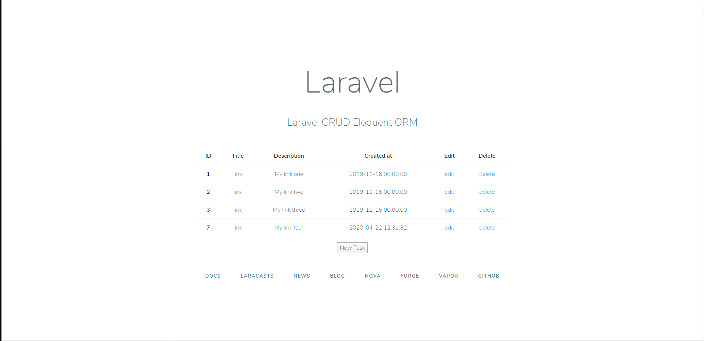
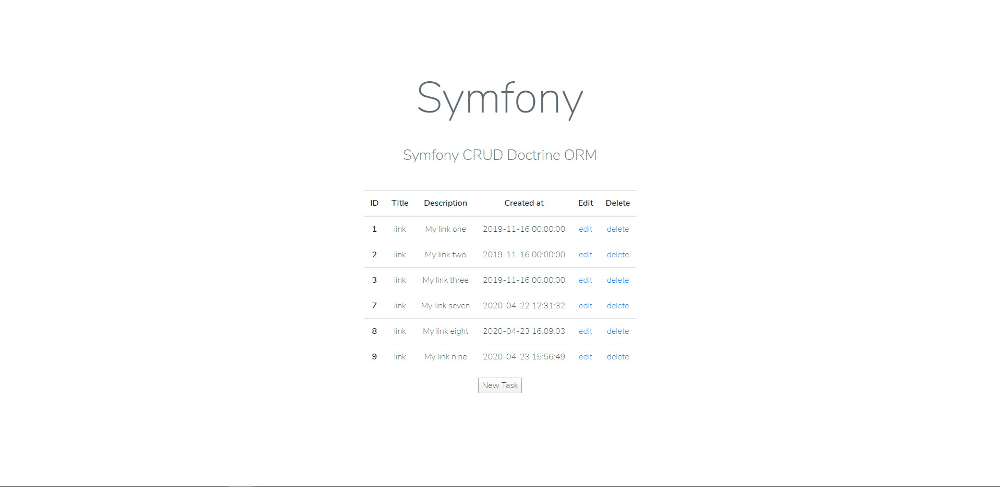
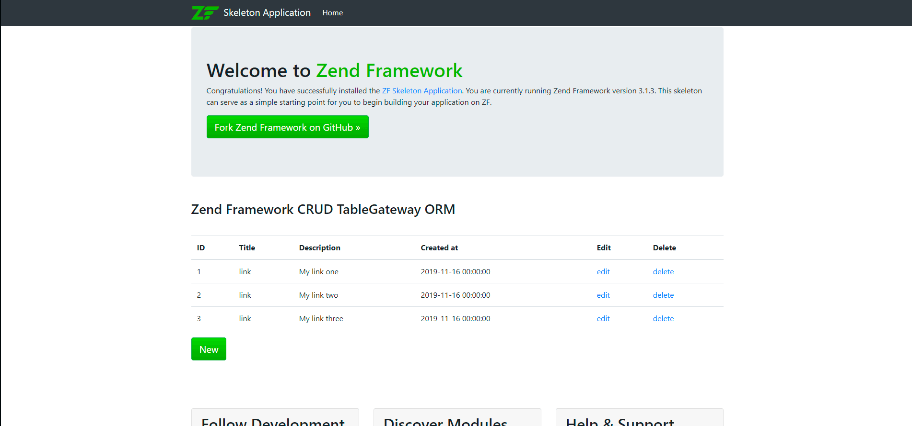

# PHP CRUD Systems — Comparativa de Implementaciones

Colección de **4 implementaciones CRUD** (Create, Read, Update, Delete) en PHP utilizando diferentes frameworks y enfoques de acceso a datos. Cada ejemplo resuelve el mismo problema — gestionar registros en una base de datos MySQL — pero con una arquitectura, ORM y stack completamente distintos. Ideal como referencia comparativa para entender las diferencias entre frameworks PHP.

[](https://www.php.net/)
[](https://laravel.com/)
[](https://symfony.com/)
[](https://framework.zend.com/)
[](https://www.mysql.com/)

---

## Tabla de Contenidos

- [Sobre el Proyecto](#sobre-el-proyecto)
- [Implementaciones](#implementaciones)
  - [Laravel Eloquent ORM](#1-laravel-eloquent-orm)
  - [PHP + PDO + AJAX + Bootstrap](#2-php--pdo--ajax--bootstrap)
  - [Symfony 5 + Doctrine ORM](#3-symfony-5--doctrine-orm)
  - [Zend Framework 3 + TableGateway](#4-zend-framework-3--tablegateway)
- [Comparativa de Enfoques](#comparativa-de-enfoques)
- [Estructura del Proyecto](#estructura-del-proyecto)
- [Requisitos](#requisitos)
- [Instalación](#instalación)
- [Recursos](#recursos)
- [Autor](#autor)

---

## Sobre el Proyecto

El patrón **CRUD** es la base de cualquier aplicación que interactúa con una base de datos. Sin embargo, la forma de implementarlo varía enormemente según el framework y el patrón de acceso a datos que se utilice: Active Record, Data Mapper, Table Gateway o acceso directo con PDO.

Este repositorio muestra 4 enfoques distintos para resolver el mismo problema, permitiendo comparar:

- **Arquitectura** — MVC completo vs. script directo
- **ORM / Data Access** — Eloquent vs. Doctrine vs. TableGateway vs. PDO
- **Templates** — Blade vs. Twig vs. PHP nativo
- **Complejidad** — Framework completo vs. vanilla PHP
- **Rendimiento** — Overhead de cada enfoque

---

## Implementaciones

### 1. Laravel Eloquent ORM

| | |
|---|---|
| **Carpeta** | `laravel-eloquent-orm-crud/` |
| **Framework** | Laravel |
| **ORM** | Eloquent (Active Record) |
| **Patrón** | Active Record |
| **Templates** | Blade |



**Eloquent** es el ORM de Laravel basado en el patrón **Active Record**: cada modelo PHP representa una tabla de la base de datos y cada instancia del modelo representa una fila. Las operaciones CRUD se realizan directamente sobre el modelo.

```php
// Create
$user = User::create(['name' => 'David', 'email' => 'david@example.com']);

// Read
$users = User::all();
$user  = User::find(1);

// Update
$user->name = 'David Berruezo';
$user->save();

// Delete
$user->delete();
```

**Características:**

- Migraciones para versionado del schema de base de datos
- Relaciones (hasOne, hasMany, belongsTo, belongsToMany)
- Mutators y Accessors para transformación de datos
- Soft Deletes, Scopes y Eager Loading
- Validación de formularios con Form Requests
- Templates Blade con herencia de layouts

---

### 2. PHP + PDO + AJAX + Bootstrap

| | |
|---|---|
| **Carpeta** | `object-crud-system-php-pdo-ajax-mysql-bootstrap/` |
| **Framework** | Ninguno (vanilla PHP) |
| **Data Access** | PDO (PHP Data Objects) |
| **Frontend** | Bootstrap + jQuery AJAX |
| **Patrón** | Procedural / OOP directo |

Implementación **sin framework** utilizando PHP nativo con PDO para el acceso a datos y **AJAX** para operaciones asíncronas sin recarga de página. El frontend se construye con **Bootstrap** para un diseño responsive.

```php
// Conexión con PDO
$pdo = new PDO('mysql:host=localhost;dbname=crud_db', 'root', 'password');

// Create (Prepared Statement)
$stmt = $pdo->prepare("INSERT INTO users (name, email) VALUES (:name, :email)");
$stmt->execute([':name' => 'David', ':email' => 'david@example.com']);

// Read
$stmt = $pdo->query("SELECT * FROM users");
$users = $stmt->fetchAll(PDO::FETCH_ASSOC);

// Update
$stmt = $pdo->prepare("UPDATE users SET name = :name WHERE id = :id");
$stmt->execute([':name' => 'David Berruezo', ':id' => 1]);

// Delete
$stmt = $pdo->prepare("DELETE FROM users WHERE id = :id");
$stmt->execute([':id' => 1]);
```

**Características:**

- Sin dependencias de framework (100% vanilla PHP)
- PDO con Prepared Statements (prevención de SQL Injection)
- Operaciones AJAX con jQuery (sin recarga de página)
- Frontend responsive con Bootstrap
- Patrón OOP para encapsular la lógica de acceso a datos
- Ideal para entender los fundamentos antes de usar un framework

---

### 3. Symfony 5 + Doctrine ORM

| | |
|---|---|
| **Carpeta** | `symfony-doctrine-orm-crud/` |
| **Framework** | Symfony 5.x |
| **ORM** | Doctrine (Data Mapper) |
| **Patrón** | Data Mapper + Repository |
| **Templates** | Twig |



**Doctrine** es el ORM de Symfony basado en el patrón **Data Mapper**: las entidades son objetos PHP puros (POPO) que no conocen la base de datos. El **EntityManager** se encarga de persistir y recuperar los objetos, y los **Repositories** encapsulan las consultas.

```php
// Create
$user = new User();
$user->setName('David');
$user->setEmail('david@example.com');
$entityManager->persist($user);
$entityManager->flush();

// Read
$users = $repository->findAll();
$user  = $repository->find(1);

// Update
$user->setName('David Berruezo');
$entityManager->flush();

// Delete
$entityManager->remove($user);
$entityManager->flush();
```

**Características:**

- Entidades como objetos PHP puros (sin herencia de clase base)
- EntityManager para Unit of Work (persistencia transaccional)
- Repositories personalizados con QueryBuilder y DQL
- Migraciones con Doctrine Migrations
- Formularios Symfony con validación por anotaciones
- Templates Twig con herencia y bloques
- Inyección de dependencias nativa

---

### 4. Zend Framework 3 + TableGateway

| | |
|---|---|
| **Carpeta** | `zend-framework3-tablegateway-orm-crud/` |
| **Framework** | Zend Framework 3 (Laminas) |
| **ORM** | TableGateway |
| **Patrón** | Table Data Gateway |
| **Templates** | PHP nativo (ViewModel) |



**TableGateway** es el patrón de acceso a datos de Zend Framework: cada instancia de `TableGateway` representa una tabla y proporciona métodos para las operaciones CRUD. Es más ligero que un ORM completo y ofrece un control más directo sobre las consultas SQL.

```php
// Create
$this->tableGateway->insert([
    'name'  => 'David',
    'email' => 'david@example.com',
]);

// Read
$rowset = $this->tableGateway->select();
$row    = $this->tableGateway->select(['id' => 1])->current();

// Update
$this->tableGateway->update(
    ['name' => 'David Berruezo'],
    ['id'   => 1]
);

// Delete
$this->tableGateway->delete(['id' => 1]);
```

**Características:**

- TableGateway como abstracción de tabla (sin mapeo a objetos completo)
- Zend\Db\Sql para construcción de queries programática
- Módulos MVC con Service Manager (inyección de dependencias)
- InputFilter para validación y filtrado de datos
- Zend\Form para formularios con elementos tipados
- Hydrators para conversión entre arrays y objetos

---

## Comparativa de Enfoques

| Aspecto | Laravel Eloquent | PHP + PDO | Symfony Doctrine | Zend TableGateway |
|---|---|---|---|---|
| **Patrón** | Active Record | Directo (PDO) | Data Mapper | Table Data Gateway |
| **ORM** | Eloquent | — | Doctrine | TableGateway |
| **Templates** | Blade | HTML + PHP | Twig | PHP (ViewModel) |
| **Frontend** | — | Bootstrap + AJAX | — | — |
| **Migraciones** | ✅ Artisan | ❌ Manual | ✅ Doctrine Migrations | ❌ Manual |
| **Inyección de Dep.** | ✅ Service Container | ❌ | ✅ Service Container | ✅ Service Manager |
| **Validación** | Form Requests | Manual | Annotations/Attributes | InputFilter |
| **Curva de aprendizaje** | Media | Baja | Alta | Media-Alta |
| **Complejidad** | Media | Baja | Alta | Media |
| **Flexibilidad SQL** | Media | Alta | Media | Alta |
| **Ideal para** | Apps rápidas | Aprender fundamentos | Apps empresariales | Apps modulares |

### ¿Cuándo Usar Cada Uno?

```
¿Necesitas un prototipo rápido?
    └── ✅ Laravel Eloquent

¿Quieres entender cómo funciona todo por debajo?
    └── ✅ PHP + PDO + AJAX

¿Proyecto empresarial con lógica de dominio compleja?
    └── ✅ Symfony + Doctrine

¿Aplicación modular con control fino sobre SQL?
    └── ✅ Zend Framework + TableGateway
```

---

## Estructura del Proyecto

```
php-crud-systems/
│
├── laravel-eloquent-orm-crud/                          # Laravel + Eloquent
│   ├── app/Models/                                     # Modelos Eloquent
│   ├── app/Http/Controllers/                           # Controladores
│   ├── database/migrations/                            # Migraciones
│   ├── resources/views/                                # Templates Blade
│   └── data_model.gif                                  # Captura del proyecto
│
├── object-crud-system-php-pdo-ajax-mysql-bootstrap/    # PHP + PDO + AJAX
│   ├── classes/                                        # Clases PHP (conexión, CRUD)
│   ├── ajax/                                           # Endpoints AJAX
│   ├── css/                                            # Bootstrap CSS
│   ├── js/                                             # jQuery + scripts
│   └── index.php                                       # Punto de entrada
│
├── symfony-doctrine-orm-crud/                          # Symfony + Doctrine
│   ├── src/Entity/                                     # Entidades Doctrine
│   ├── src/Repository/                                 # Repositorios
│   ├── src/Controller/                                 # Controladores
│   ├── src/Form/                                       # Form Types
│   ├── templates/                                      # Templates Twig
│   ├── migrations/                                     # Migraciones Doctrine
│   └── data_model.gif                                  # Captura del proyecto
│
├── zend-framework3-tablegateway-orm-crud/              # Zend Framework 3
│   ├── module/Application/                             # Módulo principal
│   │   ├── src/Controller/                             # Controladores
│   │   ├── src/Model/                                  # Modelos + TableGateway
│   │   ├── src/Form/                                   # Formularios Zend\Form
│   │   └── view/                                       # Templates PHP
│   ├── config/                                         # Configuración de módulos
│   └── data_model.gif                                  # Captura del proyecto
│
└── readme.md
```

---

## Requisitos

### Común a Todos

- **PHP** >= 7.4
- **MySQL** >= 5.7 o MariaDB >= 10.1
- **Composer** >= 2.x

### Por Implementación

| Implementación | Requisitos Adicionales |
|---|---|
| **Laravel Eloquent** | PHP >= 8.0, extensiones: `openssl`, `pdo`, `mbstring`, `tokenizer`, `xml` |
| **PHP + PDO + AJAX** | Servidor web (Apache/Nginx), extensión `pdo_mysql` |
| **Symfony Doctrine** | PHP >= 8.0, Symfony CLI (recomendado), extensiones: `intl`, `pdo_mysql` |
| **Zend Framework 3** | PHP >= 7.1, extensiones: `intl`, `pdo_mysql` |

---

## Instalación

### Laravel Eloquent ORM

```bash
cd laravel-eloquent-orm-crud
composer install
cp .env.example .env
php artisan key:generate

# Configurar DB en .env
php artisan migrate
php artisan serve
# → http://localhost:8000
```

### PHP + PDO + AJAX + Bootstrap

```bash
cd object-crud-system-php-pdo-ajax-mysql-bootstrap

# Crear la base de datos e importar el schema SQL
mysql -u root -p < database.sql

# Configurar las credenciales de conexión en el archivo de configuración
# Copiar la carpeta al servidor web
# → http://localhost/object-crud-system-php-pdo-ajax-mysql-bootstrap/
```

### Symfony 5 + Doctrine ORM

```bash
cd symfony-doctrine-orm-crud
composer install

# Configurar DATABASE_URL en .env
php bin/console doctrine:database:create
php bin/console doctrine:migrations:migrate
symfony server:start
# → http://localhost:8000
```

### Zend Framework 3 + TableGateway

```bash
cd zend-framework3-tablegateway-orm-crud
composer install

# Configurar la conexión DB en config/autoload/global.php
# Crear la base de datos e importar el schema
php -S localhost:8080 -t public
# → http://localhost:8080
```

---

## Recursos

### Frameworks y ORMs

- [Laravel — Documentación oficial](https://laravel.com/docs)
- [Laravel Eloquent ORM](https://laravel.com/docs/eloquent)
- [Symfony — Documentación oficial](https://symfony.com/doc/current/index.html)
- [Doctrine ORM](https://www.doctrine-project.org/projects/orm.html)
- [Zend Framework / Laminas](https://docs.laminas.dev/)
- [Laminas DB TableGateway](https://docs.laminas.dev/laminas-db/table-gateway/)

### PHP Nativo

- [PHP PDO — Documentación oficial](https://www.php.net/manual/en/book.pdo.php)
- [PDO Prepared Statements](https://www.php.net/manual/en/pdo.prepared-statements.php)

### Patrones de Acceso a Datos

- [Active Record — Martin Fowler](https://www.martinfowler.com/eaaCatalog/activeRecord.html)
- [Data Mapper — Martin Fowler](https://www.martinfowler.com/eaaCatalog/dataMapper.html)
- [Table Data Gateway — Martin Fowler](https://www.martinfowler.com/eaaCatalog/tableDataGateway.html)

### Frontend

- [Bootstrap — Documentación](https://getbootstrap.com/)
- [jQuery AJAX](https://api.jquery.com/jquery.ajax/)

---

## Autor

**David Berruezo** — Software Engineer | Fullstack Developer

- GitHub: [@david-berruezo](https://github.com/david-berruezo)
- Website: [davidberruezo.com](https://www.davidberruezo.com)
	
